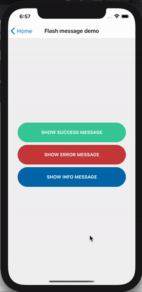

# MoP React/React Native Boilerplates/Reusable components

Welcome! These are some of the boilerplates I've created so that they can be, hopefully, useful to someone.

There are several components/hooks that are included, namely:
- [Flash message component](https://github.com/kapobajza/mop-boilerplates#flash-message-component) - a handy component to display a message at the top of your device
- [Full screen loading component](https://github.com/kapobajza/mop-boilerplates#full-screen-loading-component) - a component to display a loading screen
- `useLoading` hook - a hook that can be used when you need to use loading in your state
- `useLoadMore` hook - a hook that simplifies infinite scrolling/loading more content in your `FlatList`s

### Flash message component



This component consists of `React` context, a hook to use it anywhere you want and the component that's gonna be displayed. In order to use it in your app, first you have to include the `FlashMessageProvider` preferably in your main `App.tsx`/`App.jsx` file:

```
import { FlashMessageProvider } from './src/components/FlashMessage';

export default function App() {
  return (
    {/* other providers, like SafeAreaProvider or StoreProvider, etc. */}
    {/* You can use an optional `timeout` property to set the duration of the flash message */}
    <FlashMessageProvider timeout={3000}>
       {/* ... other children */}
    </FlashMessageProvider>
  );
}
```

Now you can simply use it inside of your components like this:

```
export default function Home() {
  const { showSuccess, showError, showInfo } = useFlashMessage();

  return (
    <View>
      <Button title="Show success message" onPress={() => showSuccess('Success message')} />
      <Button title="Show error message" onPress={() => showError(new Error('Error message'))} />
      <Button title="Show info message" onPress={() => showInfo('Info message')} />
    </View>
  );
}
```

**Note: `showSuccess` and `showInfo` are expecting a `string` as an argument, whereas `showError` expects an `Error` as an argument, as you can see in the example above. That's because you can easily handle displaying errors in a `try/catch` block, like this:**

```
const { showError } = useFlashMessage();

const someAsyncFunction = async () => {
  try {
    // Do some async work, like make an HTTP request or similar
  } catch (err) {
    showError(err);
  }
}
```

Besides using the `FlashMessage` component via hooks, you can also use it via its state, like this:

```
import { FlashMessageState } from '../components/FlashMessage';

export default function Home() {
  return (
    <View>
      <Button title="Show success message" onPress={() => FlashMessageState.showSuccess('Success message')} />
      <Button title="Show error message" onPress={() => FlashMessageState.showError(new Error('Error message'))} />
      <Button title="Show info message" onPress={() => FlashMessageState.showInfo('Info message')} />
    </View>
  );
}
```

This can be handy in case you need to use it outside of components, like in `redux` actions for example.

**Note: it is not recommended to use it this way, because it can cause unexpected behavior.**

### Full screen loading component

This component, like [Flash message component](https://github.com/kapobajza/mop-boilerplates#flash-message-component), can be used through hooks in your components. Like with [Flash message component](https://github.com/kapobajza/mop-boilerplates#flash-message-component), you have to include the `LoadingProvider` preferably in your main `App.tsx`/`App.jsx` file:

```
import { LoadingProvider } from './src/components/FullScreenLoading';

export default function App() {
  return (
    {/* other providers, like SafeAreaProvider or StoreProvider, etc. */}
    <LoadingProvider>
      {/* ... other children */}
    </LoadingProvider>
  );
}
```

And then use it inside of your components with the `useLoading` hook:

```
import { useLoading } from '../hooks';

export default function Home() {
  const { startLoading, stopLoading } = useFullScreenLoading();

  const asyncAction = async () => {
    try {
      startLoading();
      // Do an async action, like an HTTP request or similar
    } finally {
      stopLoading();
    }
  };

  return (
    <View>
      <Button title="Start action" onPress={asyncAction} />
    </View>
  );
}
```

You can also use the Full screen loading component via its state:


```
import { LoadingState } from '../hooks';

export default function Home() {
  const asyncAction = async () => {
    try {
      LoadingState.startLoading();
      // Do an async action, like an HTTP request or similar
    } finally {
      LoadingState.stopLoading();
    }
  };

  return (
    <View>
      <Button title="Start action" onPress={asyncAction} />
    </View>
  );
}
```

This can be handy in case you need to use it outside of components, like in `redux` actions for example.

**Note: it is not recommended to use it this way, because it can cause unexpected behavior.**
